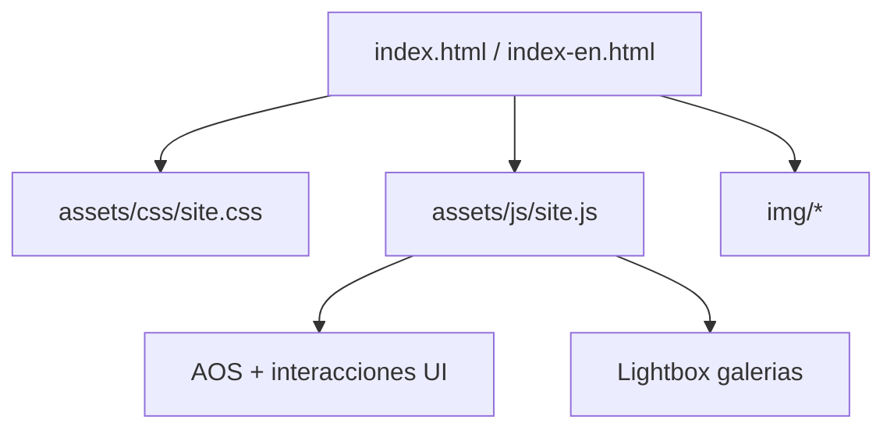

# Vientre Divino

Landing page bilingue (ES/EN) para el retiro Vientre Divino en Mount Shasta.
Disenada para conversion, confianza y claridad narrativa.

> [!NOTE]
> Proyecto estatico optimizado para carga rapida, experiencia mobile-first y mantenimiento simple.

## Estado del Proyecto

| Area | Estado |
|---|---|
| Pagina en espanol | Lista |
| Pagina en ingles | Lista |
| Responsive (mobile/tablet/desktop) | Verificado |
| Lightbox de galerias | Implementado |
| Integracion WhatsApp | Activa |

## Arquitectura

```text
vientre_divino/
|- index.html
|- index-en.html
|- README.md
|- assets/
|  |- css/
|  |  |- site.css
|  |- js/
|     |- site.js
|- img/
```



## Experiencia y Producto

### Propuesta UX

- Narrativa emocional con progresion de secciones orientada a conversion.
- Identidad visual consistente con paleta de marca y acentos editoriales.
- Priorizacion de contenido real: Mount Shasta + evidencia de retiros previos.
- Interacciones claras: menu adaptativo, tabs, FAQ, CTA a WhatsApp.

### Componentes principales

- Hero con mensaje central y llamadas a la accion.
- Seccion Shasta Focus con galeria visual ampliada.
- Seccion Proof Gallery con fotografias de experiencias previas.
- Itinerario por dias (tabs) y preguntas frecuentes (acordeon).
- Lightbox responsive con:
	- apertura al hacer click en imagen
	- navegacion anterior/siguiente
	- cierre por X, click fuera y tecla Esc

## Stack Tecnico

- HTML5 semantico
- CSS3 (variables, grid, flex, breakpoints)
- JavaScript vanilla (sin framework)
- AOS via CDN para animaciones de entrada

## Ejecutar en Local

### Opcion 1: apertura directa

```powershell
start index.html
```

### Opcion 2: servidor local recomendado

```powershell
python -m http.server 8000
```

Abrir en navegador:

```text
http://localhost:8000
```

## Operacion y Mantenimiento

### Puntos de edicion rapida

- Contenido ES: [index.html](index.html)
- Contenido EN: [index-en.html](index-en.html)
- Estilos globales: [assets/css/site.css](assets/css/site.css)
- Interacciones globales: [assets/js/site.js](assets/js/site.js)
- Recursos visuales: carpeta [img/](img/)

### Convenciones recomendadas

- Mantener rutas de imagen coherentes con la ubicacion del CSS.
- Preservar paridad funcional ES/EN en cada cambio.
- Validar en tres anchos minimos: 390px, 768px, 1280px.

## Roadmap Sugerido

- [ ] Agregar analitica de conversion (eventos CTA).
- [ ] Implementar metadata social Open Graph y Twitter Cards.
- [ ] Incorporar Lighthouse CI en pipeline.
- [ ] Optimizar imagenes criticas en formatos AVIF/WebP cuando aplique.

## Git y Despliegue

Repositorio remoto:

- https://github.com/MaickR/vientre_divino.git

Flujo estandar:

```bash
git add .
git commit -m "mensaje"
git push origin main
```

## Licencia

Proyecto de uso privado/propietario, salvo indicacion expresa del autor.
