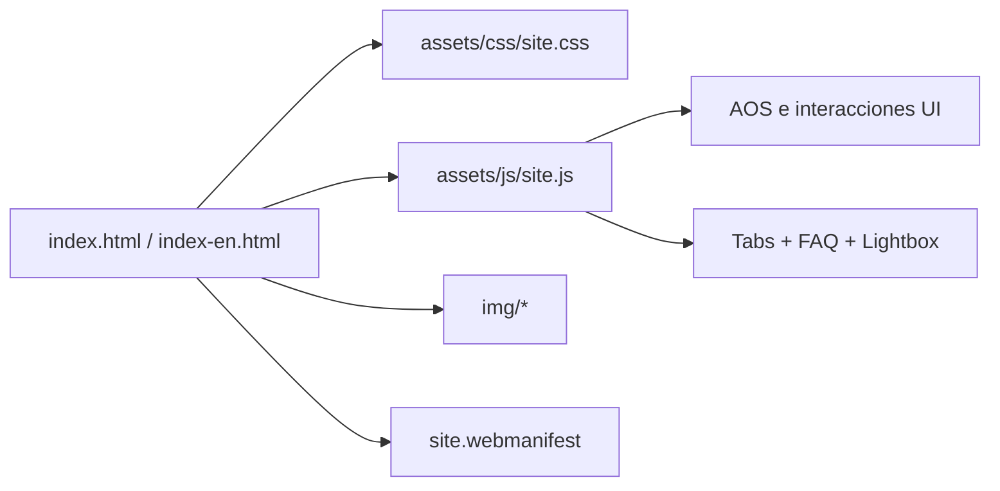

# Vientre Divino

Landing page bilingüe para el retiro Vientre Divino, una experiencia íntima para mujeres en Mount Shasta, California.

[](#descripción)
[](#contenido)
[](#stack)

> [!NOTE]
> Fechas del retiro: **27 al 30 de agosto de 2026**.

> [!TIP]
> El sitio está pensado para abrir rápido, verse bien en móvil y convertir visitas en consultas reales por WhatsApp.

## Descripción

Vientre Divino presenta una propuesta clara, emocional y directa para comunicar el retiro en español e inglés. El sitio prioriza la lectura fluida, la prueba visual, el acceso rápido al contacto y una navegación simple en cualquier dispositivo.

## Lo que incluye

- Versión en español e inglés con navegación separada.
- Diseño responsive para teléfono, tablet y escritorio.
- CTA principal hacia WhatsApp.
- Galería visual y lightbox para imágenes.
- FAQ interactiva.
- Animaciones de entrada con AOS.
- Favicon y manifiesto para mejor compatibilidad en dispositivos.

## Stack

- HTML5 semántico.
- CSS3 moderno con variables, grid y flexbox.
- JavaScript vanilla.
- AOS via CDN para animaciones suaves.

## Estructura

```text
vientre_divino/
├── index.html
├── index-en.html
├── README.md
├── site.webmanifest
├── assets/
│   ├── css/
│   │   └── site.css
│   └── js/
│       └── site.js
└── img/
    ├── logo-Mundoholistico.png
    └── ...
```



## Contenido principal

| Archivo | Propósito |
|---|---|
| [index.html](index.html) | Versión en español |
| [index-en.html](index-en.html) | Versión en inglés |
| [assets/css/site.css](assets/css/site.css) | Estilos globales |
| [assets/js/site.js](assets/js/site.js) | Interacciones de la interfaz |
| [site.webmanifest](site.webmanifest) | Soporte de iconos y experiencia PWA básica |

## Uso local

### Opción 1: abrir directamente

```powershell
start index.html
```

### Opción 2: servidor local recomendado

```powershell
python -m http.server 8000
```

Luego abrir:

```text
http://localhost:8000
```

## Criterios de calidad

- Paridad funcional entre español e inglés.
- Lectura clara en pantallas pequeñas.
- CTA visible y consistente.
- Navegación simple y sin fricción.
- Recursos optimizados para una carga ágil.

## Notas de mantenimiento

- No hay proceso de build.
- El proyecto se puede editar y publicar como sitio estático.
- Las rutas internas usan archivos locales, sin dependencias de backend.

## Licencia

Uso privado / propietario salvo indicación expresa del autor.

---

<sub>Última actualización documental: 2026-08-10</sub>
