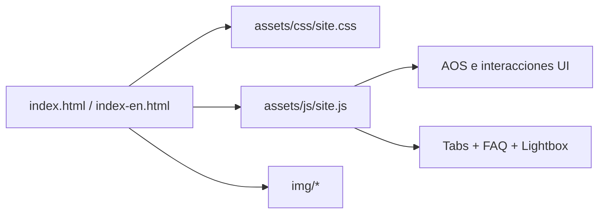

# Vientre Divino

[](#estado) [](#contenido) [](#stack)

Landing page bilingue (espanol/ingles) para el retiro Vientre Divino en Mount Shasta, California.

> [!IMPORTANT]
> Fechas vigentes del retiro: **27 al 30 de agosto de 2026**.

> [!TIP]
> El proyecto esta optimizado para conversion, carga rapida y mantenimiento simple sin dependencias de build.

## Resumen

Sitio estatico orientado a conversion con narrativa emocional, prueba social visual, itinerario por dias, FAQ y CTAs directos a WhatsApp.

## Estado

| Area | Estado |
|---|---|
| Contenido ES | Listo |
| Contenido EN | Listo |
| Responsive (mobile/tablet/desktop) | Validado |
| Lightbox de galeria | Activo |
| CTA WhatsApp | Activo |

## Arquitectura

```text
vientre_divino/
|- index.html
|- index-en.html
|- README.md
|- assets/
|  |- css/
|  |  |- site.css
|  |- js/
|     |- site.js
|- img/
```



## Stack

- HTML5 semantico
- CSS3 moderno (custom properties, grid, flex, media queries)
- JavaScript vanilla
- AOS via CDN (animaciones de entrada)

## Contenido

| Archivo | Proposito |
|---|---|
| [index.html](index.html) | Version en espanol |
| [index-en.html](index-en.html) | Version en ingles |
| [assets/css/site.css](assets/css/site.css) | Estilos globales |
| [assets/js/site.js](assets/js/site.js) | Comportamiento UI |

## Desarrollo Local

### Opcion A: apertura directa

```powershell
start index.html
```

### Opcion B: servidor local (recomendado)

```powershell
python -m http.server 8000
```

Abrir: <http://localhost:8000>

## Criterios de Calidad

- Paridad funcional entre ES y EN.
- Verificacion visual en 390px, 768px y 1280px.
- CTAs con texto y fechas coherentes.
- Imagenes optimizadas (WebP cuando aplica).

## Roadmap

- [ ] Metadata social completa (Open Graph y X Cards).
- [ ] Eventos de conversion (clicks en CTA WhatsApp).
- [ ] Auditoria automatizada con Lighthouse CI.
- [ ] Estrategia AVIF para imagenes hero/galerias.

## Git

Repositorio: <https://github.com/MaickR/vientre_divino.git>

```bash
git add .
git commit -m "mensaje"
git push origin main
```

## Licencia

Uso privado/propietario salvo indicacion expresa del autor.

---

<sub>Ultima actualizacion documental: 2026-05-18</sub>
